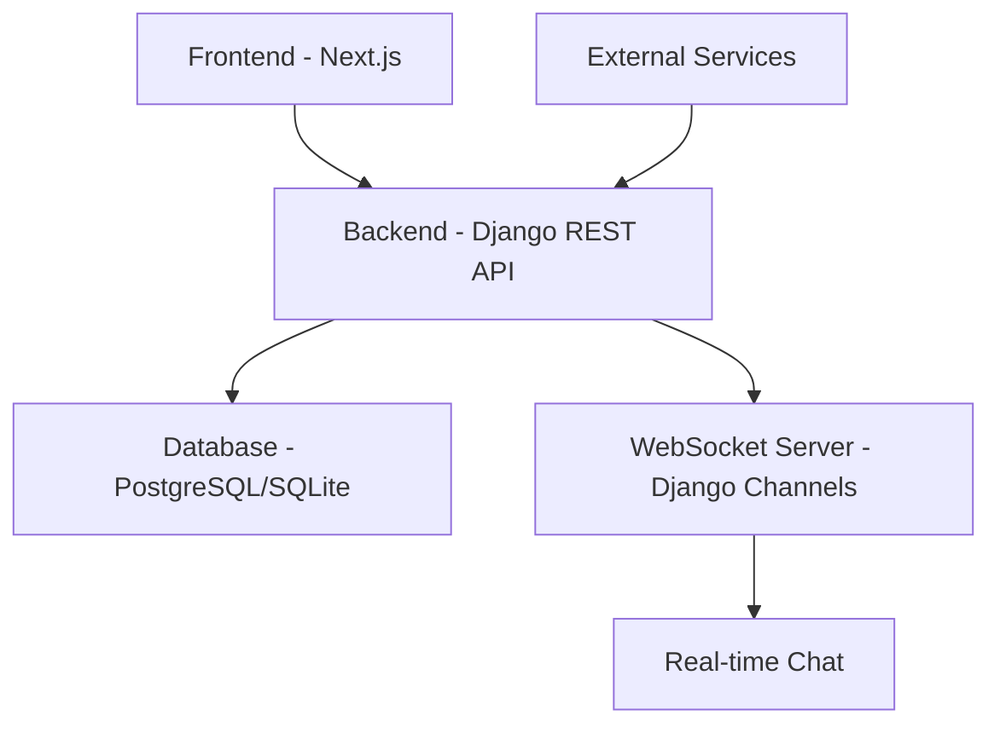
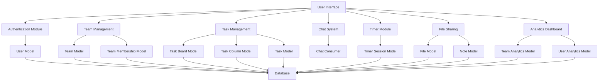

# Virtual Co-working Space Architecture

## High-Level Architecture



## Component Diagram



## Data Flow

### User Authentication Flow
1. User visits login/signup page
2. Frontend sends credentials to `/api/auth/login/` or `/api/auth/register/`
3. Backend validates credentials and creates session
4. Backend returns user data and session cookie
5. Frontend stores session and redirects to dashboard

### Team Creation Flow
1. User clicks "Create Team" button
2. Frontend sends team data to `/api/teams/create/`
3. Backend creates team and adds user as owner
4. Backend returns team data
5. Frontend updates UI with new team

### Task Management Flow
1. User creates task in a team board
2. Frontend sends task data to `/api/tasks/create/`
3. Backend validates team membership and creates task
4. Backend returns task data
5. Frontend updates Kanban board

### Real-time Chat Flow
1. User joins chat room via WebSocket connection
2. Frontend connects to `ws://localhost:8000/ws/chat/<room_name>/`
3. User sends message through WebSocket
4. Django Channels consumer receives message
5. Consumer broadcasts message to all connected clients
6. Frontend receives message and updates chat UI

### Timer Session Flow
1. User starts timer via frontend
2. Frontend sends request to `/api/timer/sessions/start/`
3. Backend creates timer session record
4. Frontend updates UI with timer display
5. User stops timer
6. Frontend sends request to `/api/timer/sessions/<session_id>/stop/`
7. Backend updates session with end time and duration
8. Frontend updates UI with session data

## Database Schema

### User Management
- **User** (Django auth user)
  - id (PK)
  - username
  - email
  - password
  - first_name
  - last_name

- **UserProfile**
  - id (PK)
  - user (FK to User)
  - bio
  - location
  - birth_date
  - avatar

### Team Management
- **Team**
  - id (PK)
  - name
  - description
  - created_at
  - updated_at
  - owner (FK to User)

- **TeamMembership**
  - id (PK)
  - user (FK to User)
  - team (FK to Team)
  - role (owner, admin, member)
  - joined_at

### Task Management
- **TaskBoard**
  - id (PK)
  - name
  - team (FK to Team)
  - created_at
  - updated_at

- **TaskColumn**
  - id (PK)
  - name
  - board (FK to TaskBoard)
  - order

- **Task**
  - id (PK)
  - title
  - description
  - assignee (FK to User, nullable)
  - creator (FK to User)
  - column (FK to TaskColumn)
  - priority (low, medium, high)
  - due_date
  - created_at
  - updated_at
  - completed

### Timer System
- **TimerSession**
  - id (PK)
  - user (FK to User)
  - team (FK to Team, nullable)
  - session_type (work, break)
  - start_time
  - end_time
  - duration

### File Sharing
- **File**
  - id (PK)
  - name
  - file (FileField)
  - uploaded_by (FK to User)
  - team (FK to Team)
  - created_at

- **Note**
  - id (PK)
  - title
  - content
  - author (FK to User)
  - team (FK to Team)
  - created_at
  - updated_at

### Analytics
- **TeamAnalytics**
  - id (PK)
  - team (FK to Team)
  - total_tasks_completed
  - total_work_hours
  - average_task_completion_time
  - last_updated

- **UserAnalytics**
  - id (PK)
  - user (FK to User)
  - team (FK to Team)
  - tasks_completed
  - work_hours
  - tasks_created
  - last_updated
```